# Training Orchestrator: K8s-Native ML Compute Platform
This project automates the transition from Model Code to Cloud Compute.

The platform's job is to schedule the training container and inject credentials/config
into it - it does not itself call the MLflow or W&B SDKs. The training script (in the
researcher's own repo/image) is responsible for `mlflow.log_*`/`wandb.init()`/`wandb.log()`
calls; MLflow and W&B are additive to each other, not a either/or choice.

```mermaid
graph TD
    %% Global Styling
    classDef control fill:#f1f,stroke:#333,stroke-width:2px;
    classDef compute fill:#b3f,stroke:#333,stroke-width:2px,color:#fff;
    classDef storage fill:#902,stroke:#333,stroke-width:2px;
    classDef user fill:#000,stroke:#333,stroke-dasharray: 5 5;

    %% User Interaction
    User[ML Experiment Input] -- "POST /jobs (Repo URL)" --> API[FastAPI Orchestrator]

    subgraph Control_Plane [The Orchestrator Logic]
        API -->|1. Generate UUID| JobID[Unique Job ID]
        API -->|2. Kubernetes SDK| K8sAPI[K8s API Server]
    end

    subgraph Kubernetes_Cluster [Ephemeral Compute Plane]
        subgraph Training_Pod [Kubernetes Job Pod]
            direction TB
            Init[Init Container: Git Clone] -->|Clone to Shared Volume| Shared[(EmptyDir Volume)]
            Shared --> Main[Main Container: Python Training]
        end
    end

    subgraph Infrastructure_Layer [External Platform Services]
        MLflow[MLflow Server]
        WandB[Weights & Biases]
        S3[(SeaweedFS/MinIO/S3)]
    end

    %% Execution Flows
    K8sAPI ==>|3. Schedule Job| Training_Pod
    Main -->|4. Stream Metrics| MLflow
    Main -->|4. Stream Metrics| WandB
    Main -->|5. Upload Artifacts| S3
    MLflow -->|6. Metadata Reference| S3
    
    %% Cleanup Flow
    K8sAPI -.->|7. TTL Expiry| Training_Pod

    %% Assign Classes
    class API,JobID,K8sAPI control;
    class Main,Init compute;
    class MLflow,WandB,S3,Shared storage;
    class User user;
```

